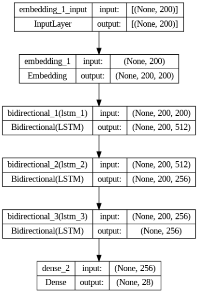

# IA

## Une description des problématiques IA rencontrées dans votre projet,

Dans notre application, nous avons voulu transformer le contenu d'un texte dans une émotion.

## Une explication de l'intégration de l'IA dans votre application :

Nous avons développé un modèle d'analyse des émotions basé sur l'apprentissage automatique, utilisant des techniques de traitement du langage naturel (NLP) comme l'élimination de mot vide (qui ne sont pas nécessaire pour le sens de la phrase). Pour notre modèle, nous somme partie sur un LSTM car il est adapté pour les séquences de données comme du texte. Il permet de retenir sur la durée de la phrase des informations sur les données d'entrée et de les utiliser pour prédire les données de sortie.

Nous avons utilisé le framework Tensorflow pour créer notre modèle. Nous avons utilisé un dataset de plus de 20000 phrases avec des émotions associées, GoEmotions, nous avons trouvé ce dataset intéressant car il est plus complet que les autres, en nombre de données et d'émotions différentes (28 émotions différentes). 

Après le traitement des données (gestion des donnée redondante, null...), nous avons ensuite utilisé un tokenizer pour transformer les phrases en vecteurs de nombres, puis nous avons utilisé un modèle LSTM pour prédire l'émotion associée à la phrase.  

Nous avons également utilisé des vecteurs de mots pré-entraînés à partir d'un fichier GloVe (Global Vectors for Word Representation) et les utilise pour construire une matrice d'incorporation (embedding_matrix). La matrice d'incorporation est ensuite utilisée pour initialiser les poids de la couche d'incorporation dans un modèle de réseau neuronal. Ces vecteurs de mots capturent des informations sémantiques sur les mots, et les utiliser comme poids initiaux dans une couche d'incorporation peut aider un modèle de traitement du langage naturel à mieux comprendre le sens des mots dans un contexte donné.

### Décrivez ce que vous avez réalisé qui relève de l'IA ou ce que vous auriez pu faire avec des outils d'IA existants ou imaginaires

Le but final réalisé était la génération d'un smiley en fonction d'un topic du forum de notre site web pour avoir un retour visuel sur l'émotion de la discussion. Ceci pourrais aider a reconaitre une discussion qui fait débat ou qui est en train de déraper, facilitant la modération et la gestion des discussions.

Nous arrions voulu que notre modèle ait de bonne performance pour cette tache cependant, par manque de ressource et de temps pour entrainer le modèle avec tous les paramètres a leur plein potentiel, nous avons du nous contenter d'un modèle qui n'est pas très performant avec des paramètres réduits.

Un but imaginé est, pour chaque conversation, avoir un modèle qui calcule pour à quelle point la discussion est dans l'échange constructive ou non. Et de le faire remonter à un admin à ce moment la, ainsi pour faciliter la modération de l'ensemble des discussions.
    
### Différenciez les bouts de codes et soft existants (citez vos sources), des parties spécifiées et codées en propre pour le défi

Une de nos source principale pour la création du modèle est le tutoriel suivant : [Sentiment Analysis using LSTM, TensorFlow, and Keras](https://www.embedded-robotics.com/sentiment-analysis-using-lstm/)

Il décrit la création d'un modèle LSTM pour l'analyse de sentiment uniquement binaire (positif/négatif). Nous avons donc repris ce modèle pour l'adapter à notre problème d'analyse d'émotion multiples.

### Donnez un "use-case"/exemple illustratif

Des personnes discutent sur un forum, le modèle analyse les phrases et détermine l'émotion du topic de la discussion. Un smiley est généré en fonction de l'émotion. Cela permet d'avoir un retour visuel rapide sur l'émotion de la discussion.

Cela peut être utilisé pour aider à la modération des discussions, en permettant de voir rapidement si une discussion est en train de déraper ou non, ou fait débat ce qui permet de réagir plus rapidement en cas de diffusions de propos inappropriés ou de fausses informations autour de l'écologie (sujet de la nuit de l'info).

### Fournissez une Annexe Technique.

Voir le modèle que nous avons appliqué pour entrainer notre IA.
Dans la pratique, les différentes couches sont beaucoup trop couteuse pour nos petits PCs et le temps qu'on a.

De ce fait, nous avons simplifié lors de l'entrainement du modèle mais le résultat au final sont assez mauvais.

Probablement qu'avec plus d'entrainement, de réflexions, et gpu nous aurions pu arriver à un meilleur modèle.

## Une analyse des avantages et inconvénients de cette intégration.

Dans le cas où notre modèle fonctionnait correctement, il pourrait prendre en comptes beaucoup d'émotions différentes (28).
Cependant prendre en compte autant d'émotions, augement fortement le nombre de features de notre modèle ce qui nous ammène la mal"diction de la dimensionalité (donc pas ouf).
